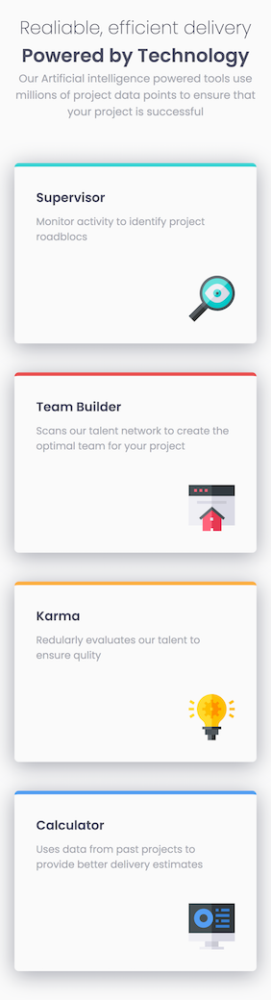

# Frontend Mentor - Four card feature section solution

This is a solution to the [Four card feature section challenge on Frontend Mentor](https://www.frontendmentor.io/challenges/four-card-feature-section-weK1eFYK). Frontend Mentor challenges help you improve your coding skills by building realistic projects.

## Table of contents

- [Overview](#overview)
  - [The challenge](#the-challenge)
  - [Screenshot](#screenshot)
  - [Links](#links)
- [My process](#my-process)
  - [Built with](#built-with)
- [Author](#author)

## Overview

The objective of the project, the layout of 4 cards for a desktop and mobile screen

### The challenge

Users should be able to:

- View the optimal layout for the site depending on their device's screen size

### Screenshot

### Links

- Live Site URL: [four-card-feature-section-master](https://johnnie-lc.github.io/four-card-feature-section-master/)

## My process

### Built with

- Semantic HTML5 markup
- CSS custom properties
- CSS Grid

## Author

- Frontend Mentor - [@Johnnie-LC](https://www.frontendmentor.io/profile/Johnnie-LC)
- Twitter - [@Johnnie_ELC](https://www.twitter.com/Johnnie_ELC)
